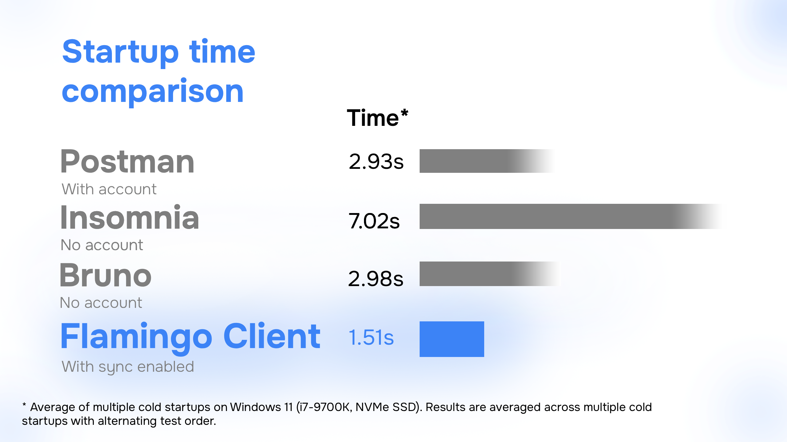

---

title: "About Flamingo Client: Our Mission and Vision"
date: 2026-05-20
description: "We have a strong mission with Flamingo, to build a better client for developers."
image: hero.webp
authors:
  - name: Javier Fernández
    github: "jallox"
    x: "@JavierFern87783"

---

## What is Flamingo

Flamingo is an open-source, offline-first and lightning-fast API client designed for backend and frontend developers who just want a simple and efficient workflow.

The goal behind Flamingo has always been clear: create a modern API client that feels fast, clean and easy to use without overwhelming developers with unnecessary complexity.

It includes many useful features while still keeping the experience lightweight and intuitive, especially for solo developers and small teams.

Its simplicity allows newer developers to quickly understand how API testing works, while still being powerful enough for more advanced workflows.

---

## Why we started building Flamingo

I've been building APIs for years, and one day I decided it was time to upgrade my API client to the latest version.

That quickly became a frustrating experience.

I suddenly needed to create an account just to use the software. Then came workspaces, cloud sync, team setups and all sorts of things I simply didn't need at that moment. I just wanted to test a few endpoints and organize my requests.

So I started trying alternatives like Insomnia, Bruno and Cartero. Some were definitely simpler, but none of them really gave me the same feeling older API clients used to have: speed, simplicity and efficiency.

At some point I realized that modern API tools were becoming more focused on enterprise workflows than on the average developer experience.

And since I'm a developer myself, I decided to build the tool I personally wanted to use every day.

That's how Flamingo Client started.

An open-source, free and offline-first API client focused on doing the essentials really well:

* fast startup,
* clean UX,
* quick API testing,
* no mandatory accounts,
* no unnecessary setup,
* and no feature overload.

Flamingo is still in beta and there's still a lot to improve, but the mission behind it is simple:

**Build an API client that developers genuinely enjoy using again.**

I don't want Flamingo to become another bloated platform overloaded with features that most solo developers will never use. I want it to stay fast, focused and enjoyable.

That's the vision behind this project.

If that sounds interesting to you, feel free to try Flamingo and share your feedback ❤️
