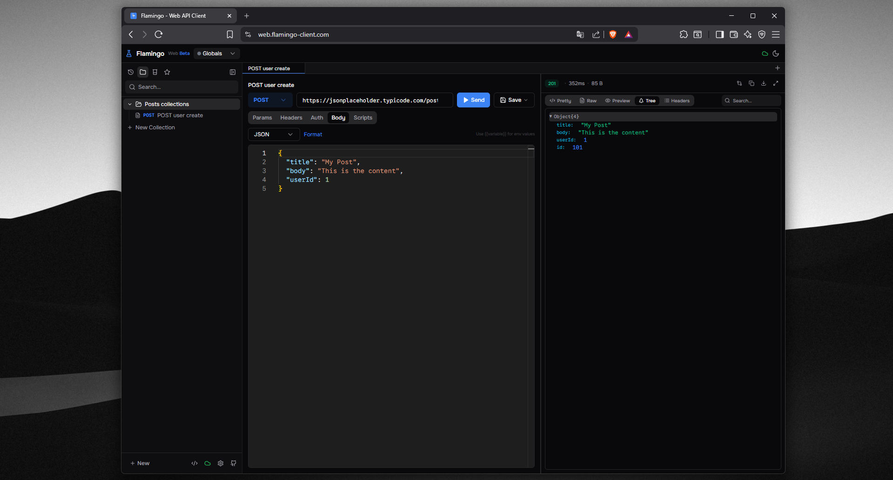

Hello Developers! We are excited to announce the release of **Flamingo Web Client**! After months of development, Flamingo is no longer just a desktop app, it is now available directly in your browser.

## What's included

**Core Features**
- Full HTTP request builder with headers, params, body, and auth
- Environment variables with dynamic resolution
- Collections and nested folders for organizing requests
- Automatic request history with search and filtering
- Multi-tab interface with resizable panels
- Pre/post-request script engine
- cURL command import
  

## Why a web client

We had one mission from the start: **Build an API client that developers genuinely enjoy using again.**

With Flamingo Web, we are bringing that experience to anyone with a modern browser. No downloads, no installs, no Electron, just open a tab and start working.

The web version shares the exact same codebase, components, and design language as the desktop app. The only differences are browser-imposed limitations like CORS, system proxy access, and file system operations — limitations we clearly communicate with a one-time warning modal on first use.

## What about the desktop app

The desktop app is not going anywhere. In fact, it remains the recommended choice for power users who need:

- **No CORS restrictions**: make any request without browser limitations
- **System proxy support**: route requests through your VPN or proxy
- **Full file system access**: import local files and save responses to disk
- **Native auth flows**: OAuth and certificate-based authentication

The web client is a complement, not a replacement. Use whichever fits your workflow.

## Sync and login

Flamingo Web supports the same cloud sync as the desktop app:

- **End-to-end encryption**: all data encrypted with AES-256-GCM before leaving your browser
- **Multi-device**: sign in from any device, data syncs automatically
- **Selective sync**: choose exactly which data types to sync
- **Zero knowledge**: the server never sees your unencrypted data

Sign in from the sidebar, and your collections, environments, history, and settings sync across all your devices.

## What's next

We are maintaining a constant update rhythm. Upcoming features include:

- WebSocket support for real-time testing
- Request chaining and test workflows
- Collaborative workspaces
- Plugin system for custom auth methods and body parsers

## Links

- **Try it now:** [web.flamingo-client.com](https://web.flamingo-client.com)
- **Download desktop app:** [App Releases](https://www.flamingo-client.com/downloads)
- **Report issues:** [GitHub Issues](https://github.com/Flamingo-Client/Flamingo/issues)

---

With Flamingo Web, we are one step closer to our goal: **an API client that developers genuinely enjoy using again.**

Happy Testing!
