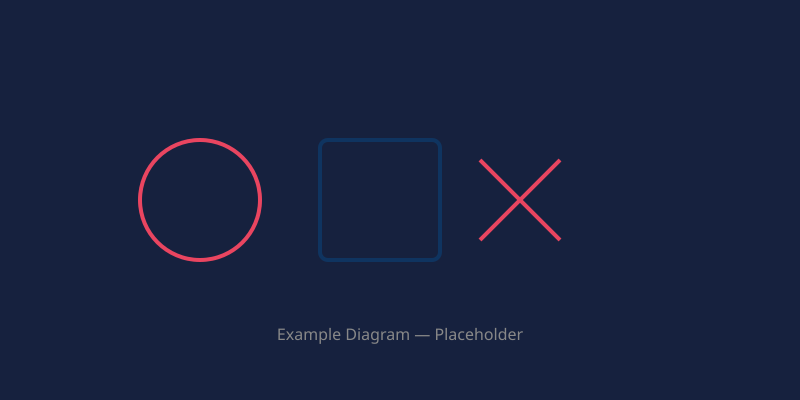

----
title: "The Ultimate Blog Post — A Feature Showcase"
date: 2025-06-15
description: "A comprehensive demonstration of every markdown feature supported by the blog system, including alerts, images, code blocks, tables, and more."
image: hero.svg
authors:
  - name: Jane Doe
    github: janedoe
    x: "@jane_doe"
    website: https://janedoe.dev
  - name: John Smith
    github: johnsmith
----

## Alerts (GitHub-style callouts)

A regular blockquote without a marker — no special styling:

> This is a plain blockquote.
> It renders as a normal `<blockquote>`.

> [!NOTE] Keep this in mind
> Useful information that users should know, even when skimming.

> [!TIP] Pro tip
> You can use **markdown** inside alerts, including `inline code` and [links](https://example.com).

> [!WARNING] Heads up
> This is important. Pay attention to the amber border — it means caution.

> [!DANGER] Critical
> This is a danger alert. Something could go wrong if ignored.

Alerts without an explicit title fall back to the type name:

> [!NOTE]
> Just a note — no title needed.

> [!TIP]
> A handy tip with no extra title.

---

## Images

Hero image set via frontmatter (`image: hero.svg`) appears at the top of the page.

Inline images use relative paths to the `images/` folder:



You can also use any full URL directly:


---

## Text Formatting

**Bold**, *italic*, ~~strikethrough~~, `inline code`, combined **bold and *italic***.

---

## Links

- [GitHub](https://github.com)
- [Blog repo](https://github.com/Flamingo-Client/blog)
- [Relative link](/blog)

---

## Code Blocks

### TypeScript

```ts
interface Author {
  name: string
  github?: string
  x?: string
  website?: string
}
```

### Bash

```bash
curl -fsSL https://flamingo.sh | sh
```

### JSON

```json
{
  "title": "Example",
  "authors": [
    { "name": "Jane Doe", "github": "janedoe" }
  ]
}
```

### Diff

```diff
- const old = 'deprecated'
+ const new = 'updated'
```

### Inline code

Run `npm run dev` to start the development server.

---

## Lists

### Unordered

- Item one
- Item two
  - Nested item A
  - Nested item B
- Item three

### Ordered

1. First step
2. Second step
3. Third step

### Task list

- [x] Implement blog system
- [ ] Add pagination
- [ ] Write documentation

---

## Tables

| Feature        | Status | Priority |
|----------------|--------|----------|
| Alerts         | ✅     | High     |
| Author cards   | ✅     | High     |
| Image support  | ✅     | Medium   |
| Pagination     | ❌     | Low      |

---

## Blockquotes with nested content

> ### Nested heading
>
> - List inside a blockquote
> - Still works
>
> ```ts
> const x = 1
> ```
>
> > Nested blockquote inside blockquote

---

## Thematic break

Above this paragraph is a horizontal rule. Below this paragraph is another one.

---

## HTML passthrough

Raw HTML is supported by the renderer:

<div style="padding: 1rem; border: 1px solid var(--border); border-radius: 0.5rem; background: var(--muted);">
  <p style="margin: 0; font-weight: 600;">Custom HTML block</p>
  <p style="margin: 0.5rem 0 0;">This div was written directly in HTML.</p>
</div>

---

## Long description truncation

This description in the frontmatter should be auto-truncated to 150 characters. Lorem ipsum dolor sit amet, consectetur adipiscing elit. Sed do eiusmod tempor incididunt ut labore et dolore magna aliqua. Ut enim ad minim veniam, quis nostrud exercitation ullamco laboris nisi ut aliquip ex ea commodo consequat. Duis aute irure dolor in reprehenderit in voluptate velit esse cillum dolore eu fugiat nulla pariatur.

---

## Conclusion

Every feature demonstrated above is supported out of the box. Push this `test-blog` directory to the `Flamingo-Client/blog` repo and visit `/blog/test-blog` to see it rendered live.
