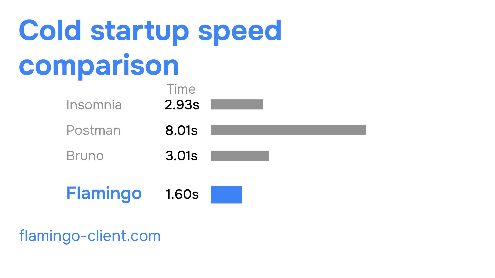

---

title: "Why Modern API Clients Feel Bloated"
date: 2026-05-26
description: "Testing an API shouldn't feel like opening a corporate dashboard."
image: hero.webp
authors:

* name: Javier Fernández
  github: "jallox"
  x: "@JavierFern87783"

---

In recent years, many awesome API clients for REST API testing have appeared, but as they evolved they became less developer-friendly and more "enterprise-ready".

When you first open one of these API clients, you'll often find yourself in a complicated flow where you first need to create an account in order to use the program. You just downloaded a desktop application that needs an account to work, why? **Why not simply make synchronization optional?**

Then comes the onboarding process. A very extensive set of questions that you have to answer in order to configure your preferences (and probably personalize the experience and ads). If you manage to get through all of this without uninstalling the software, you'll finally arrive at an overcomplicated UI filled with options, tabs, pages and menus, but the URL input to actually test an API endpoint is nowhere to be seen.

You have to dig through teams when you're the only developer, create a workspace when you're just testing a random REST API you found online, and only then you are finally able to send a request.

These features are great for companies with hundreds or thousands of developers collaborating on the same backend infrastructure, testing the same routes and sharing requests. But, **what happened to simple and developer-friendly API testing tools?**

Many companies believed that by continuously adding more features their product would automatically become **"the best API client"**, which is not always true. Something developers value the most is **simplicity, speed and workflow efficiency**, regardless of how many features a program includes.

As more functionality gets added, the software often becomes slower and heavier. Just imagine: it's Friday afternoon and you simply need to test a new API endpoint to verify everything works correctly. You don't want to spend minutes opening the app, navigating through menus or waiting for synchronization. You just want to test the request quickly, finish your work and go home.

This is one of the main reasons why lightweight and offline-first developer tools are becoming more attractive again.

In conclusion, these tools are still great for large teams and enterprise workflows, but many solo developers simply need something lighter, faster and more focused.

That's where **Flamingo Client** comes in: a lightweight open-source API client focused on speed, simplicity and developer experience.

Stop wasting time setting up accounts, answering onboarding questions or searching for the request URL input. Just **install, open and fetch** within seconds.

Faster startup than many alternatives, lightweight software, a clean and modern UI, offline-first workflows, and most importantly: **open-source and free forever**.

**Maybe software doesn’t always need more features. Maybe it just needs to feel good to use again.**
